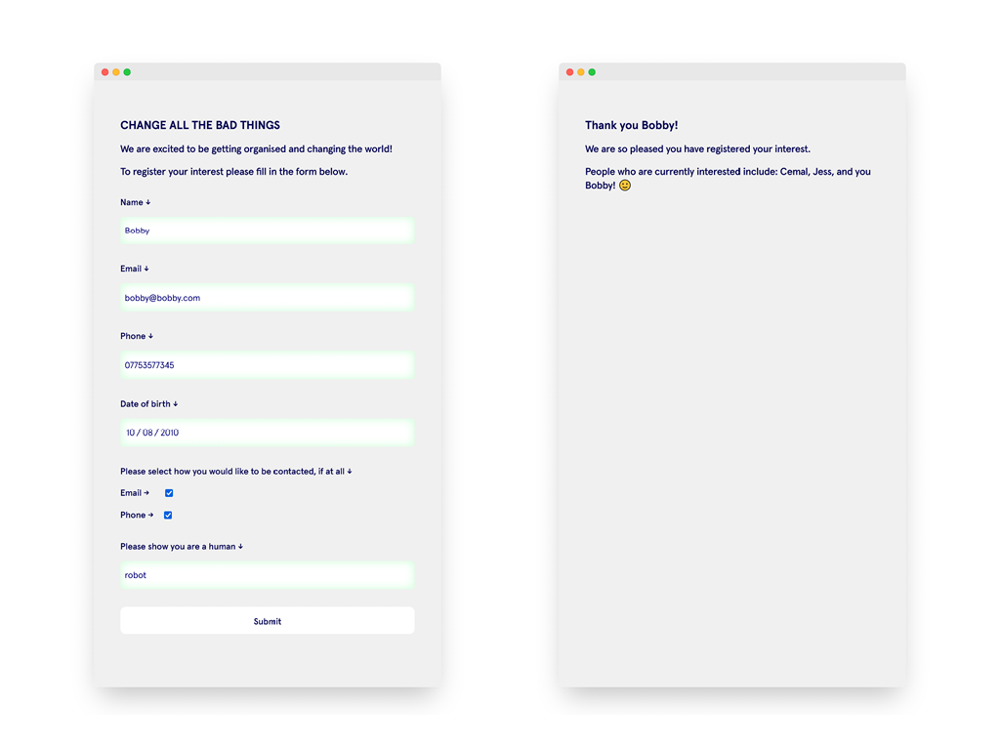

### CHANGE ALL THE BAD THINGS 🔮

Collects the details of people interested in making change happen with the `Change All Bad Things` campaign.

Built for the [Common Knowledge](https://commonknowledge.coop/) take home challenge.

Uses a `firebase` realtime database to store user details.

Font is `Apercu` (trial) by [Colophon Foundry](https://www.colophon-foundry.org/typefaces/apercu/)

### 🧱 Features

- Validates the form on type
- Validates if an `email` and `phone` number fit the correct format
- `Date of birth` range is from 1920 - 2010
- Uses a randomly generated phrase to check if the user is a `human` or `robot`
- Stores submited details in a `firebase` realtime database
- Optimised for mobile
- After submit the user is shown a page with other peoples names who are interested to create a sense of community.

### 📚 What I learnt

- Basic use of a `firebase` database (through tutorials)
- Validating forms with `pattern`
- Using CSS to show `valid`, `invalid` styles on input
- How to update the default `tool tips` with custom messages
- Append data from a database to a page

### 🦺 Testing

- [x] Tested on Android Firefox and Chrome
- [x] Tested in Mobile developer mode on Firefox, Chrome and Edge
- [x] Desktop version tested on Firefox, Chrome and Edge

### ⏳ Future improvements

- Switch email and telephone checkboxes for radio buttons (email OR phone)
- Create a page where all data can be seen (ideally behind some authentication)
- Implement proper page loader, instead of `setTimeout()`
- Send user an email to confirm their details

### 👀 Screenshots

